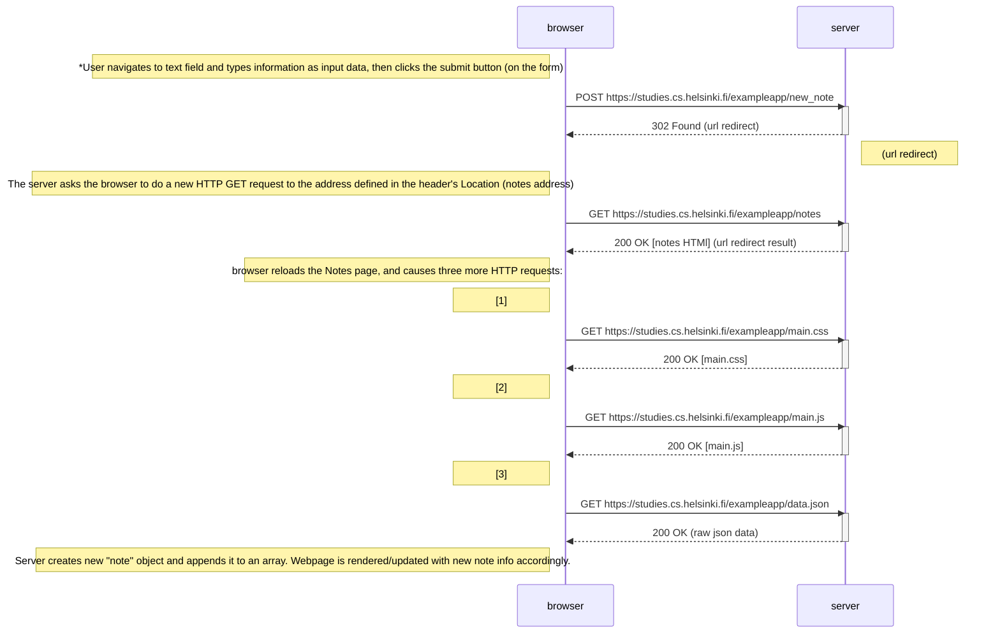

```mermaid
sequenceDiagram
    participant browser
    participant server

    Note left of browser: *User navigates to text field and types information as input data, then clicks the submit button (on the form)
    
    browser->>server: POST https://studies.cs.helsinki.fi/exampleapp/new_note
    activate server
    server-->>browser: 302 Found (url redirect) 
    deactivate server

    Note right of server: (url redirect) 
    Note left of browser: The server asks the browser to do a new HTTP GET request to the address defined in the header's Location (notes address)

    browser->>server: GET https://studies.cs.helsinki.fi/exampleapp/notes
    activate server
    server-->>browser: 200 OK [notes HTMl] (url redirect result) 
    deactivate server

    Note left of browser: browser reloads the Notes page, and causes three more HTTP requests:

    Note left of browser: [1]
    browser->>server: GET https://studies.cs.helsinki.fi/exampleapp/main.css
    activate server
    server-->>browser: 200 OK [main.css]
    deactivate server

    Note left of browser: [2]
    browser->>server: GET https://studies.cs.helsinki.fi/exampleapp/main.js
    activate server
    server-->>browser: 200 OK [main.js]
    deactivate server

    Note left of browser: [3]
    browser->>server: GET https://studies.cs.helsinki.fi/exampleapp/data.json
    activate server
    server-->>browser: 200 OK (raw json data)
    deactivate server 
    
    Note left of browser: Server creates new "note" object and appends it to an array. Webpage is rendered/updated with new note info accordingly.
```