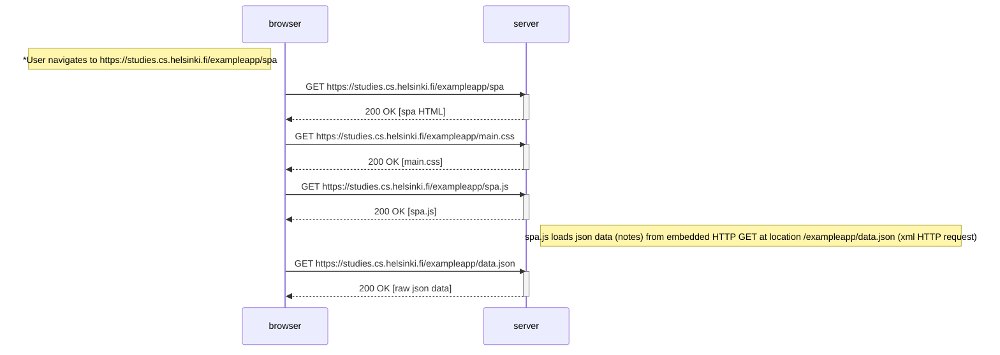

```mermaid
sequenceDiagram
    participant browser
    participant server

    Note left of browser: *User navigates to https://studies.cs.helsinki.fi/exampleapp/spa
    
    browser->>server: GET https://studies.cs.helsinki.fi/exampleapp/spa
    activate server
    server-->>browser:  200 OK [spa HTML]
    deactivate server

    browser->>server: GET https://studies.cs.helsinki.fi/exampleapp/main.css
    activate server
    server-->>browser:  200 OK [main.css]
    deactivate server

    browser->>server: GET https://studies.cs.helsinki.fi/exampleapp/spa.js
    activate server
    server-->>browser:  200 OK [spa.js] 
    deactivate server

    Note right of server: spa.js loads json data (notes) from embedded HTTP GET at location /exampleapp/data.json (xml HTTP request)

    browser->>server: GET https://studies.cs.helsinki.fi/exampleapp/data.json
    activate server
    server-->>browser:  200 OK [raw json data] 
    deactivate server
```