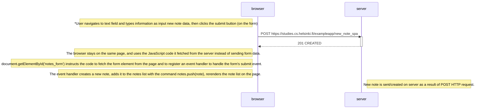

```mermaid
sequenceDiagram
    participant browser
    participant server

    Note left of browser: *User navigates to text field and types information as input new note data, then clicks the submit button (on the form)
    
    browser->>server: POST https://studies.cs.helsinki.fi/exampleapp/new_note_spa
    activate server
    server-->>browser: 201 CREATED
    deactivate server

    Note left of browser: The browser stays on the same page, and uses the JavaScript code it fetched from the server instead of sending form data.

    Note left of browser: document.getElementById('notes_form') instructs the code to fetch the form element from the page and to register an event handler to handle the form's submit event.

    Note left of browser: The event handler creates a new note, adds it to the notes list with the command notes.push(note), rerenders the note list on the page.

    Note right of server: New note is sent/created on server as a result of POST HTTP request.
```